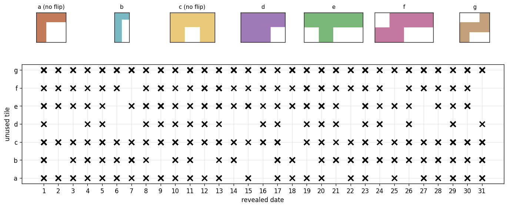

# Kalendar

A solver and playable game for **Kalendar**, a calendar tile puzzle.

The board is a 5×7 grid holding the days **1–31** (the last four cells are dead).
You have **7 tiles** and must place **6 of them** so that every day cell is
covered **except one** — the revealed date. Every date has many solutions; this
repo finds them all and lets you play and browse them.



## Layout

```
kalendar/            Python package — the puzzle logic
  board.py             the 5×7 board and dead cells
  pieces.py            the 7 tile shapes (a–g), flip flags, colours
  placements.py        every legal placement of a tile
  solver.py            recursive backtracking solver
  render.py            matplotlib rendering of solutions and stats
scripts/             command-line entry points
  solve.py             run the solver  ->  data/solutions.npz
  show.py              show solutions for a given day
  stats.py             render assets/stats.png
  export_web.py        data/solutions.npz  ->  web/solutions.js
data/solutions.npz   all solutions (see schema below)
web/                 standalone browser game (just open index.html)
notebooks/           exploration.ipynb
```

## Quick start

```bash
pip install -r requirements.txt

python scripts/solve.py          # find all solutions -> data/solutions.npz
python scripts/show.py 14 --all  # show solutions that reveal day 14
python scripts/stats.py          # regenerate assets/stats.png
python scripts/export_web.py     # refresh the data the web game uses
```

## Play it

Open **`web/index.html`** in any browser (no server needed). Drag pieces onto the
board, rotate/flip them, or pick a day and hit **Show Solution** to browse every
solution for that date.

## Data format — `data/solutions.npz`

| key            | shape / dtype   | meaning                                        |
| -------------- | --------------- | ---------------------------------------------- |
| `grid`         | `(N, 5, 7)` i8  | per-cell tile id `0–6`; date cell `-1`; dead `-2` |
| `date`         | `(N,)` i8       | the revealed day, `1–31`                       |
| `unused_piece` | `(N,)` i8       | index `0–6` of the tile left out               |

A tile's 0/1 mask is recoverable as `grid == piece_id`.

## How the solver works

Each tile covers exactly 5 cells and the board has 31 day cells. Placing 6
non-overlapping tiles that avoid the dead cells therefore covers exactly 30 day
cells, leaving exactly one uncovered — the revealed date. So *any* legal
arrangement of 6 non-overlapping tiles is a valid solution; the solver
enumerates them all by backtracking. There are **1149** in total.
